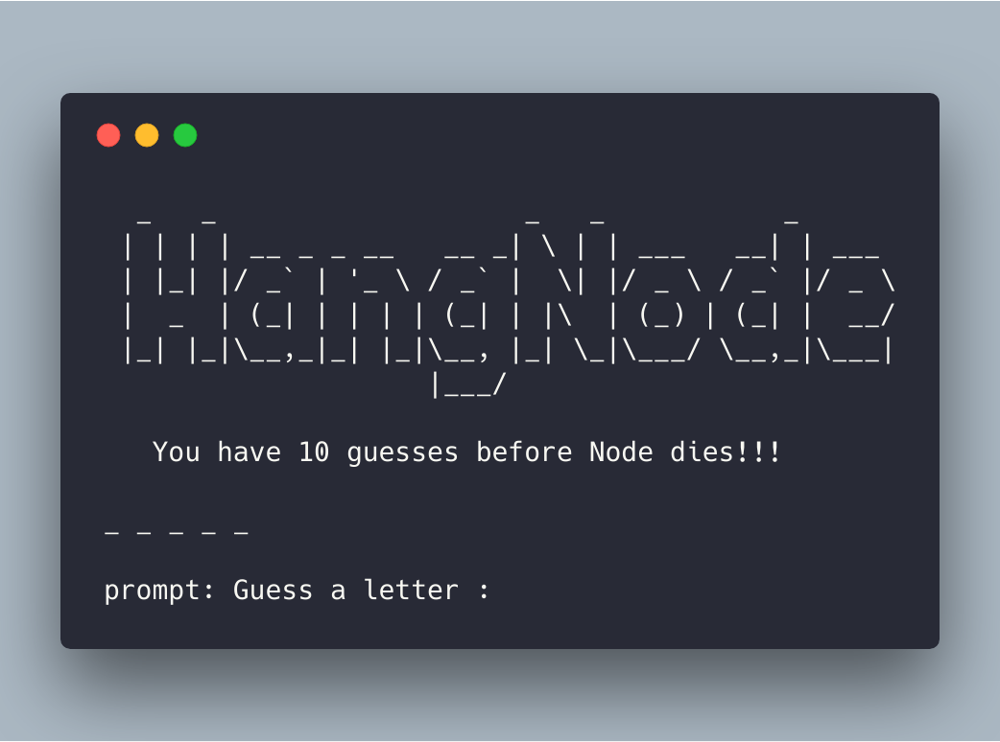

# HangNode

HangNode is a basic CLI / Node.js based Hangman game.

Directions:

Note: Make sure you're in the project root directory. Then run the below commands.

1. npm install
2. node index.js

Enjoy!